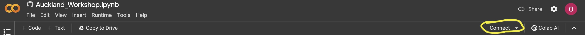

# Tutorial on generating EMRI trajectories and Waveforms.

## How to access the tutorial on collab

To access the tutorial, [click me!](https://colab.research.google.com/github/OllieBurke/EMRI_Workshop/blob/main/docs/Auckland_Workshop.ipynb)

If you were successfull, you should have made it to a google collab notebook.

## Accessing GPUs

To get access to the GPUs, follow the steps carefully:

1. 
2. 
3. 

